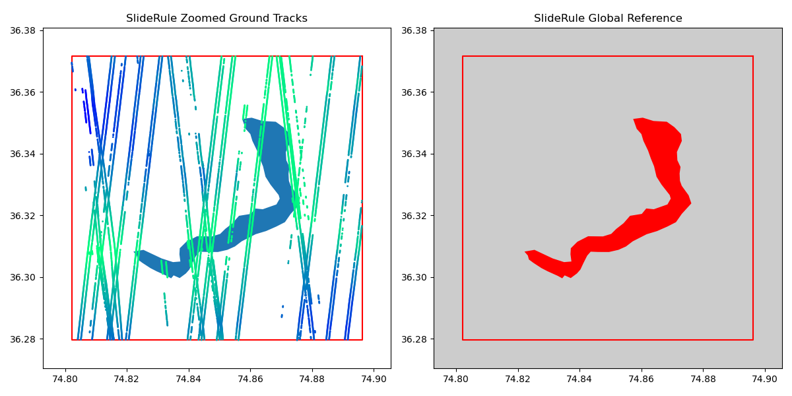
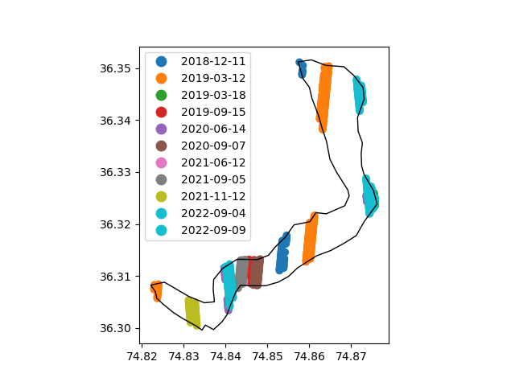
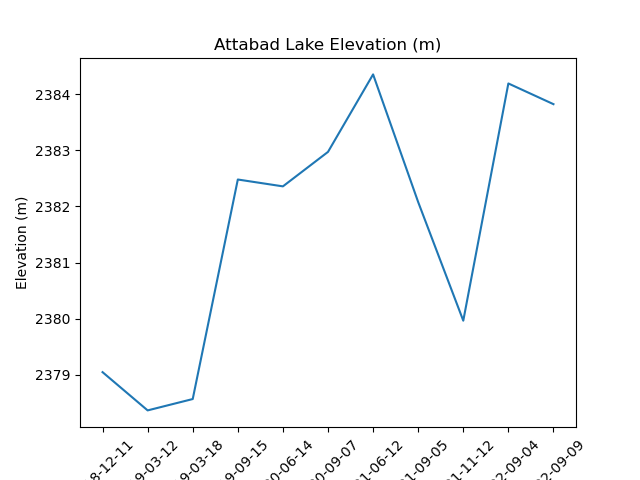

# Team 3DLAKE

## Team Members

The following people contributed to our project throughout the week:
* Project lead: [Imran Khan]
* Helper: [Christian Kienholz]
* Team member: [Siddhi Garg]
* Team member: [Vengus Panhwar]
* Team memeber: [Jonathan Burton]

## Project Goals

To gain experience working with tutorial material related to ICESat-2, Github, and collaborative coding environment like Jupyter.
To create and practice some basic python functions and run with ICESat-2 data. 
To use and integrate diverse sets of data.

## Project Outcomes

* Gained experience of working in JupyterHub, using it to access, download and process ICESat-2 data.
* Explored lakes with ICESat-2 data available.

* Added some functionality to the tutorial codes to process ICESat-2 data
* Visualized the ICESat-2 tracks over study site - Attabad Lake in High Mountain Asia

* Pulled surface elevation for ATL06 (for various dates) for our study site
* Did projection transformations for the lake shapefiles
* Obtained the lake elevation timeseries for the Attabad Lake 

* Created shapefiles of glacial lakes in North Patagonia and the High Mountain Asia
* Downloaded the SRTM DEMs for glacial lakes and icefield in North Patagonia
* Downloaded RGI glacier outlines

## Future Efforts

Hoping to continue collaborating with group members

